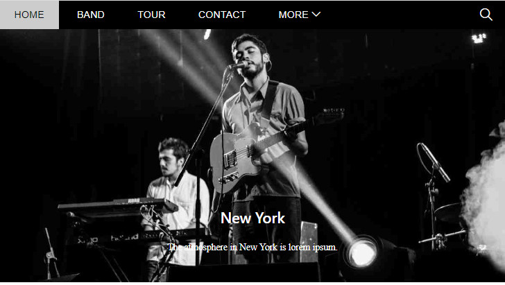
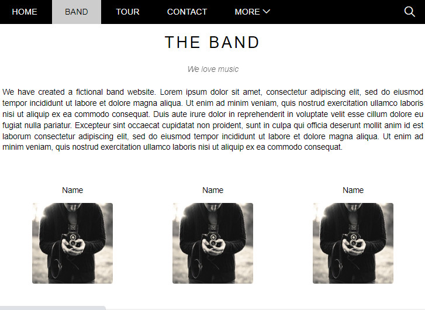
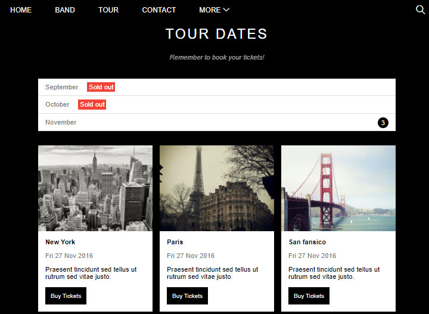
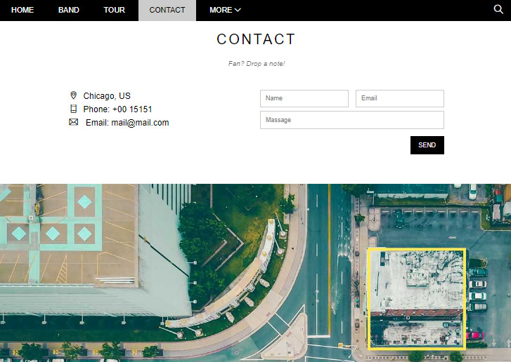
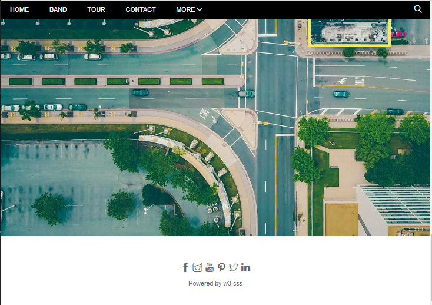

# The-Band-webiste
***
## Built The Band Website by HTML, CSS
#### Temple sample:
> [The Band W3School](https://www.w3schools.com/w3css/tryw3css_templates_band.htm)
#### Icon:
> [Themify Icons](https://themify.me/themify-icons)
or
> [Font Awesome](https://fontawesome.com/icons)

#### Report:
> [MyReport](https://docs.google.com/document/d/17Dmw9fUJfpM4qIYk1pLFmWJRaSrR5O0e/edit?usp=sharing&ouid=100338683301398529926&rtpof=true&sd=true)
---

### Steps
1.Tạo project base \
2.Navigation CSS \
3.Header search CSS\
4. Header fixed CSS\
5. Slider CSS\
6. About section CSS \
7. Team section CSS\
8.Tour tickets CSS\
9. Buy tickets modal\
10.Buy tickets modal Javascript logic\
11.Contact form CSS\
12. Map, footer CSS\
Review
### Demo Website

